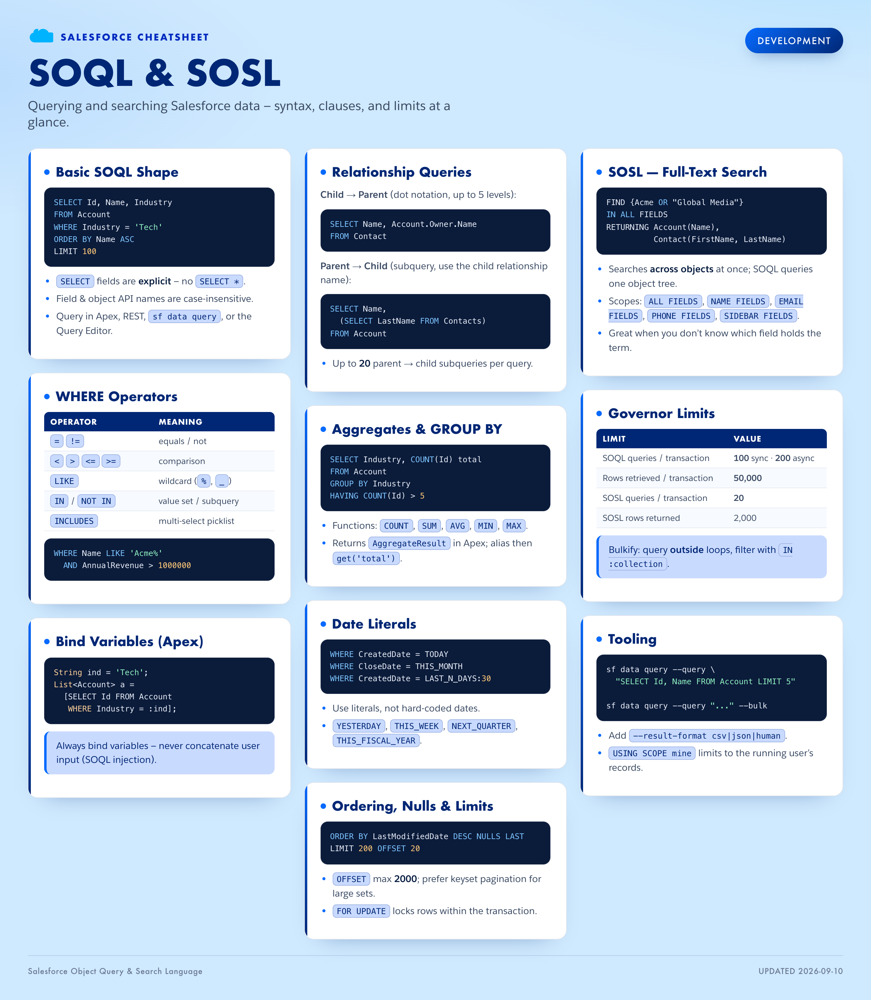
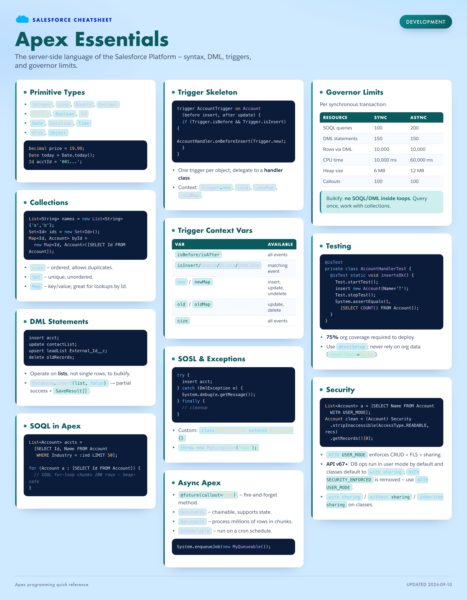
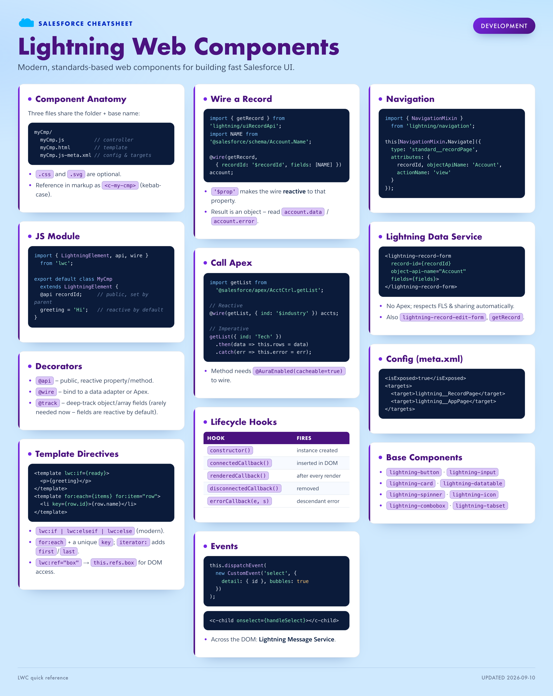
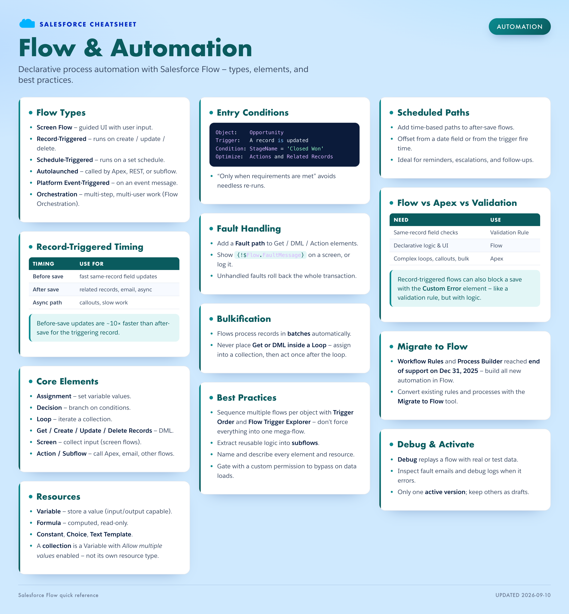
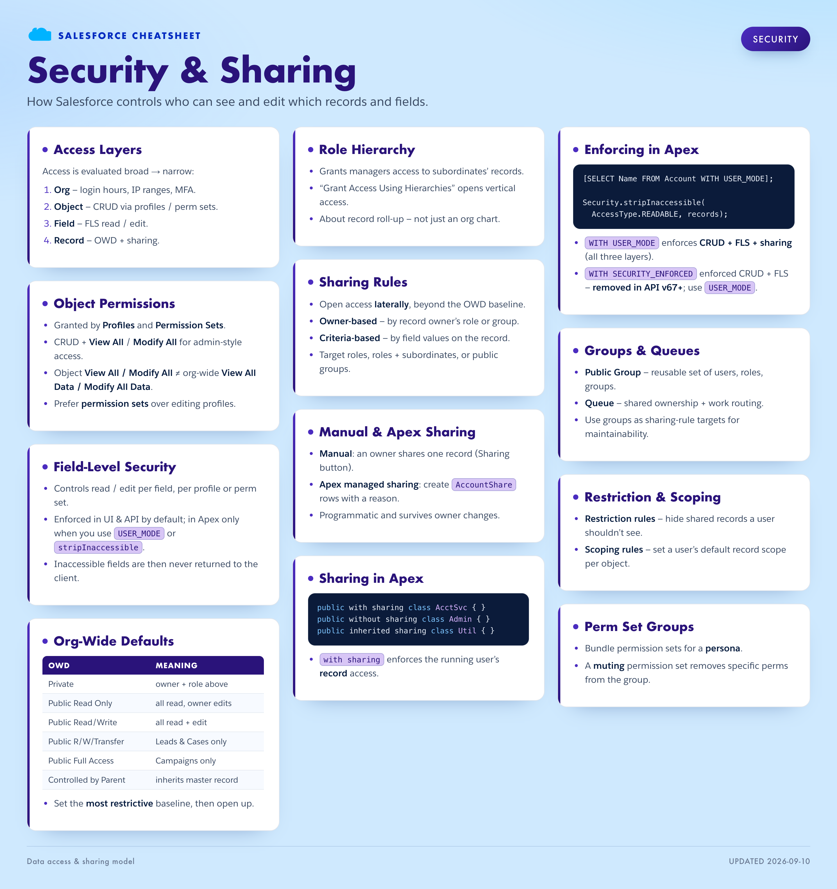
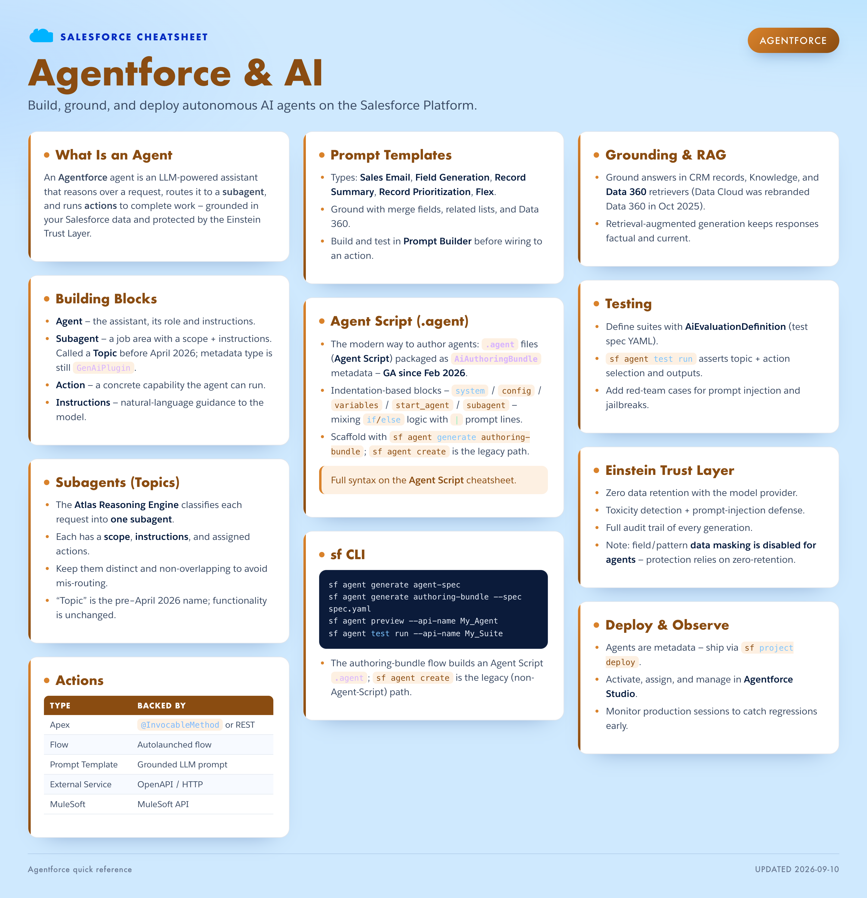
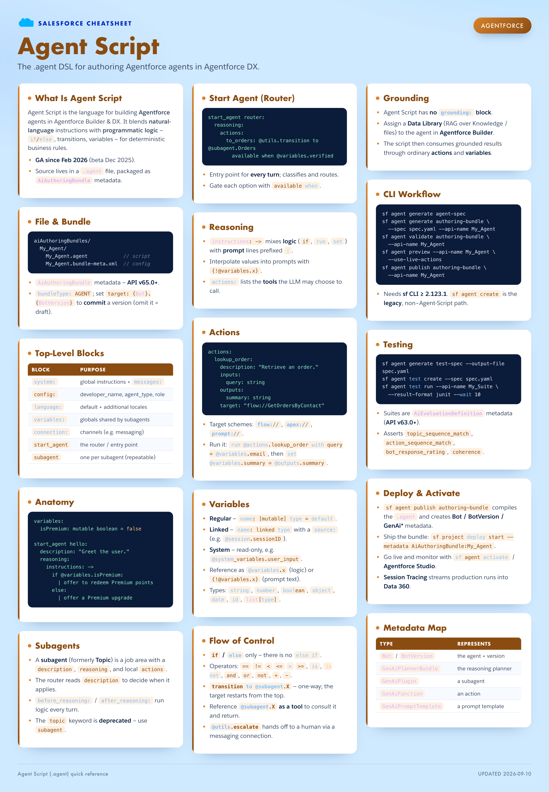
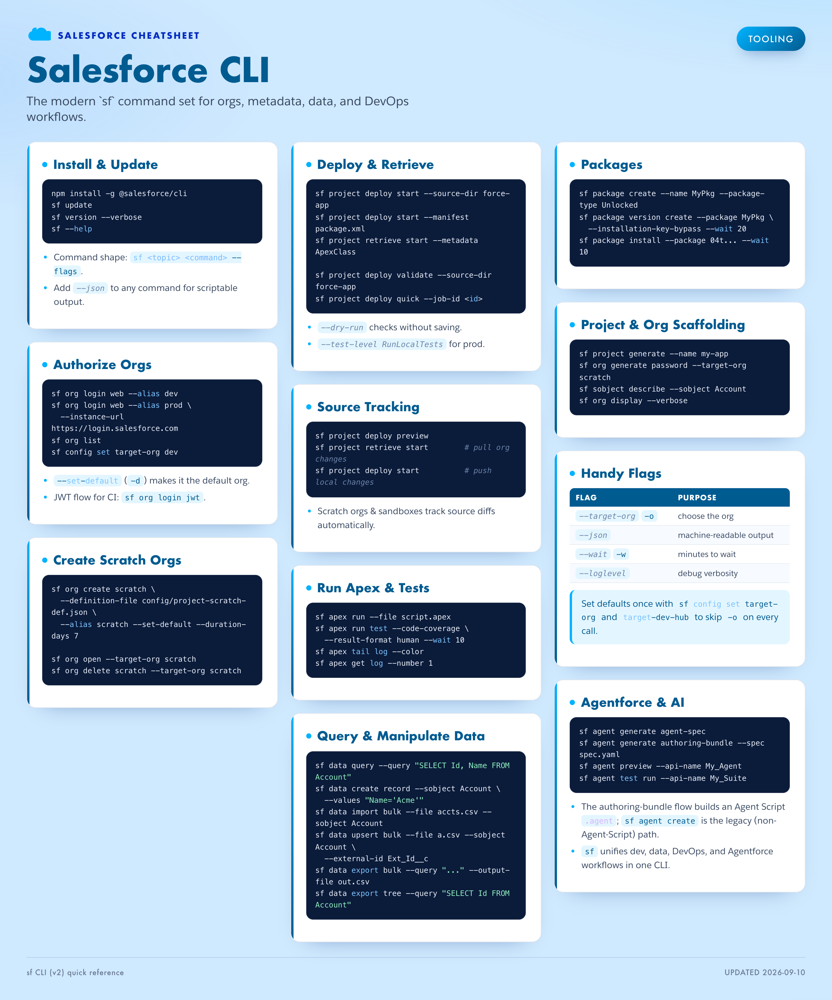

# Salesforce Cheatsheets

Beautiful, Salesforce-branded quick-reference cheatsheets for the Salesforce
ecosystem. Author in **Markdown**, render to crisp **PNG / JPG** images and a
print-ready **PDF**.


## Cheatsheets

Click any poster for full resolution, or grab the print-ready PDF.

### SOQL & SOSL
[](dist/soql-sosl.png)
📄 [Print PDF](dist/soql-sosl.pdf)

### Apex Basics
[](dist/apex-basics.png)
📄 [Print PDF](dist/apex-basics.pdf)

### Lightning Web Components
[](dist/lwc.png)
📄 [Print PDF](dist/lwc.pdf)

### Flow & Automation
[](dist/flow-automation.png)
📄 [Print PDF](dist/flow-automation.pdf)

### Security & Sharing
[](dist/security-sharing.png)
📄 [Print PDF](dist/security-sharing.pdf)

### Agentforce & AI
[](dist/agentforce.png)
📄 [Print PDF](dist/agentforce.pdf)

### Agent Script
[](dist/agent-script.png)
📄 [Print PDF](dist/agent-script.pdf)

### Salesforce CLI
[](dist/sf-cli.png)
📄 [Print PDF](dist/sf-cli.pdf)

## How it works

```
content/<topic>.md   →   Salesforce-branded HTML   →   dist/<topic>.png · .jpg · .pdf
```

Each Markdown file is one cheatsheet. Every `##` section becomes a **card** in a
balanced multi-column poster, styled with the official Salesforce color tokens
and typography. A headless Chrome renders the HTML to a high-resolution image
(2× device scale).

## Quick start

```bash
npm install            # one-time
npm run build          # render every content/*.md to dist/*.png + *.pdf
```

Then open the files in `dist/`.

## Commands

| Command | What it does |
|---------|--------------|
| `npm run build` | Render all sheets to **PNG + PDF** (+ HTML preview) |
| `npm run build:all` | PNG **and** JPG **and** PDF |
| `npm run build:jpg` | JPG only |
| `npm run build:pdf` | Print-ready PDF only |
| `npm run build:html` | HTML only — fast, no Chrome needed |
| `node src/build.mjs soql-sosl` | Build a single sheet by its slug |
| `npm run clean` | Delete `dist/` |

The PDF is a single page sized exactly to the poster (no A4 pagination).

## Authoring a cheatsheet

Create `content/my-topic.md` with front-matter, then write `##` sections:

```markdown
---
title: My Topic
subtitle: One-line description shown under the title.
category: Development        # chip in the top-right
accent: electric             # electric | cloud | indigo | teal | violet | orange
columns: 3                   # 1–4 columns
footer: Optional footer text
---

## First Card

- Bullet points, **bold**, `inline code`.

​```apex
System.debug('code blocks are syntax-highlighted');
​```

## Second Card

| Col | Col |
|-----|-----|
| a   | b   |

> Blockquotes render as accent "tip" callouts.
```

**Conventions**
- `##` = a card title. `###` = a subhead inside a card. Text before the first
  `##` is ignored on the poster.
- Keep cards focused; more small cards balance the columns better than a few
  huge ones.
- Use fenced code with a language (`apex`, `soql`, `bash`, `sql`, `xml`, `js`).

## Requirements

- Node 18+ and a Chromium-based browser (Chrome, Edge, or Chromium).
  Set `CHROME_PATH` if it isn't at the default macOS location.
