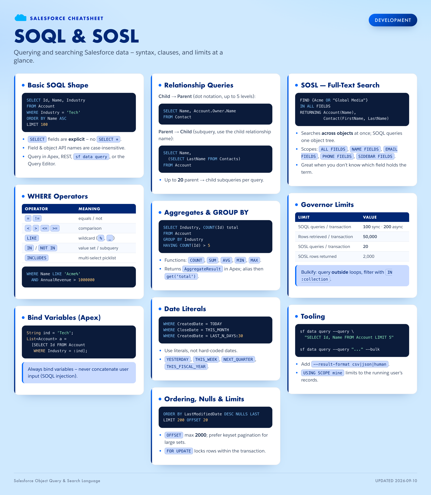
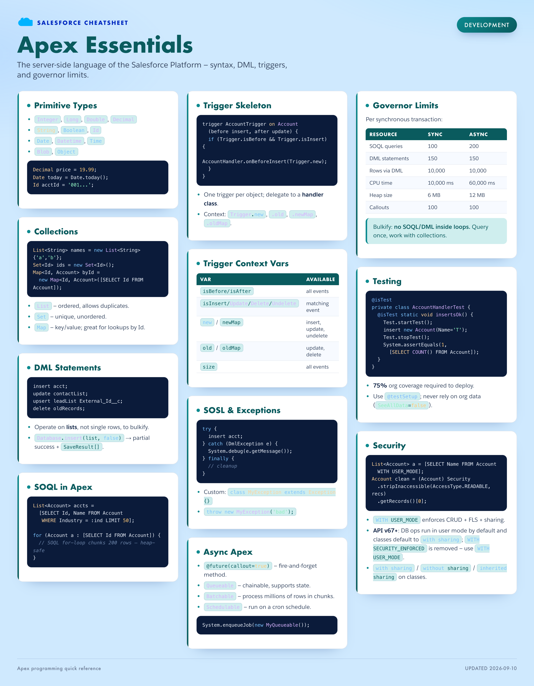
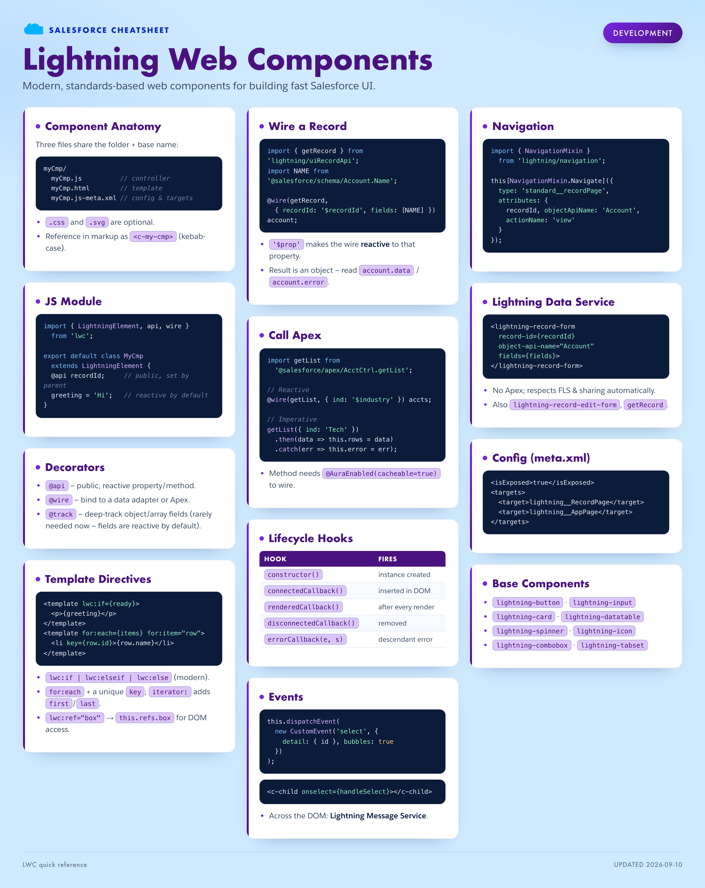
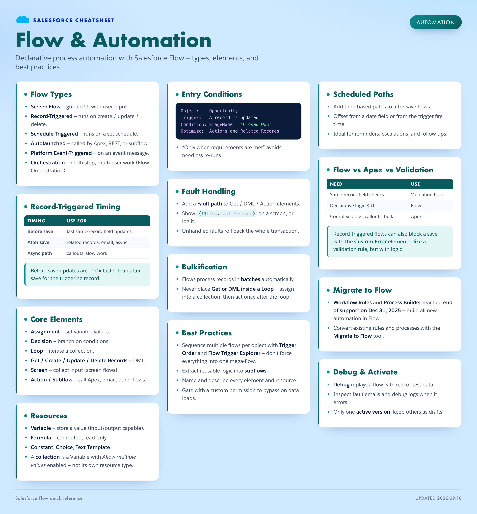
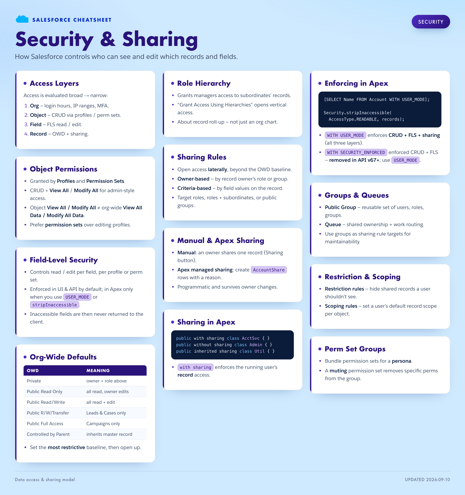
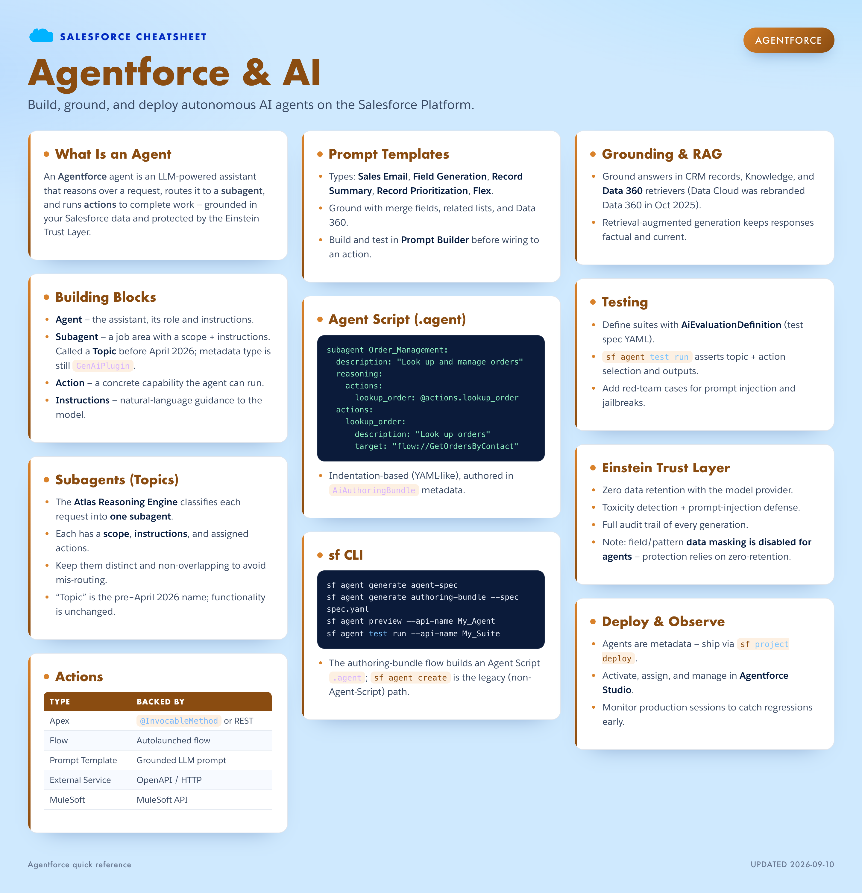
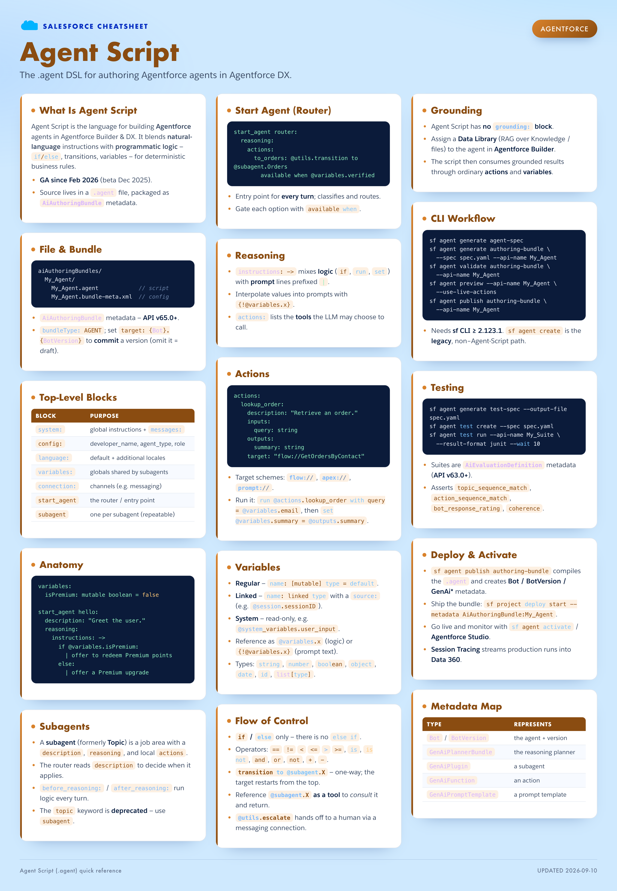
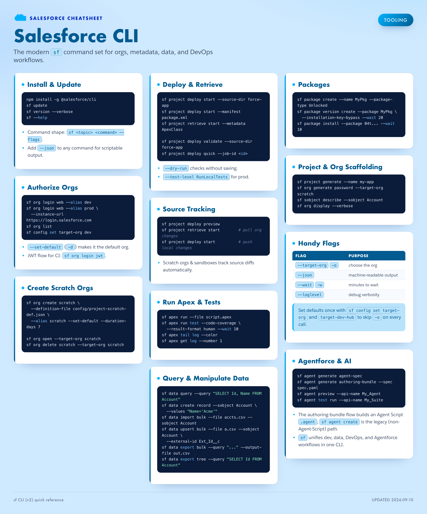
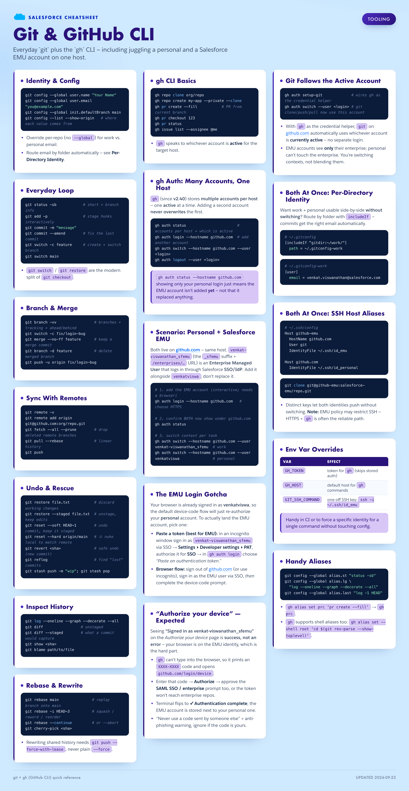

# Salesforce Cheatsheets

Salesforce-branded quick-reference posters for the Salesforce ecosystem.
Write them in **Markdown**, then render them to high-resolution **PNG** images
and print-ready single-page **PDFs**.


## Cheatsheets

Click a poster to see it at full resolution, or use the PDF link to print it.

<table>
  <tr>
    <td align="center" valign="top" width="33%">
      <a href="dist/soql-sosl.png"></a><br>
      <b>SOQL &amp; SOSL</b><br><a href="dist/soql-sosl.pdf">PDF</a>
    </td>
    <td align="center" valign="top" width="33%">
      <a href="dist/apex-basics.png"></a><br>
      <b>Apex Essentials</b><br><a href="dist/apex-basics.pdf">PDF</a>
    </td>
    <td align="center" valign="top" width="33%">
      <a href="dist/lwc.png"></a><br>
      <b>Lightning Web Components</b><br><a href="dist/lwc.pdf">PDF</a>
    </td>
  </tr>
  <tr>
    <td align="center" valign="top">
      <a href="dist/flow-automation.png"></a><br>
      <b>Flow &amp; Automation</b><br><a href="dist/flow-automation.pdf">PDF</a>
    </td>
    <td align="center" valign="top">
      <a href="dist/security-sharing.png"></a><br>
      <b>Security &amp; Sharing</b><br><a href="dist/security-sharing.pdf">PDF</a>
    </td>
    <td align="center" valign="top">
      <a href="dist/agentforce.png"></a><br>
      <b>Agentforce &amp; AI</b><br><a href="dist/agentforce.pdf">PDF</a>
    </td>
  </tr>
  <tr>
    <td align="center" valign="top">
      <a href="dist/agent-script.png"></a><br>
      <b>Agent Script</b><br><a href="dist/agent-script.pdf">PDF</a>
    </td>
    <td align="center" valign="top">
      <a href="dist/sf-cli.png"></a><br>
      <b>Salesforce CLI</b><br><a href="dist/sf-cli.pdf">PDF</a>
    </td>
    <td align="center" valign="top">
      <a href="dist/git-github.png"></a><br>
      <b>Git &amp; GitHub CLI</b><br><a href="dist/git-github.pdf">PDF</a>
    </td>
  </tr>
</table>

## How it works

```
content/<slug>.md  →  branded HTML  →  headless Chrome  →  dist/<slug>.png · .pdf
```

Each Markdown file is one cheatsheet, and each `##` section becomes a **card**.
The cards flow into balanced CSS columns styled with the Salesforce color
tokens. Headless Chrome then captures the page at 2× scale for the PNG and
prints it as a single page sized to the poster for the PDF (no A4 page breaks).

## Quick start

Requires **Node 18+** and a Chromium-based browser (Chrome, Edge, or Chromium).

```bash
npm install     # one-time
npm run build   # render every content/*.md to dist/*.png + *.pdf
```

## Commands

| Command | Output |
|---------|--------|
| `npm run build` | PNG + PDF for every sheet (plus an HTML preview) |
| `npm run build:all` | PNG + JPG + PDF |
| `npm run build:png` / `build:jpg` / `build:pdf` | One format only |
| `npm run build:html` | HTML only: a fast preview that doesn't need Chrome |
| `node src/build.mjs <slug>` | One sheet, e.g. `node src/build.mjs soql-sosl` |
| `npm run clean` | Deletes `dist/` |

The build looks for Chrome first in `CHROME_PATH`, then in the standard macOS
and Linux install locations. Set `CHROME_PATH` if your browser is installed
somewhere else.

## Authoring a cheatsheet

Create `content/<slug>.md`:

````markdown
---
title: My Topic
subtitle: One line under the title — inline `code` and **bold** work.
category: Development      # chip in the top-right corner
accent: electric           # electric | cloud | indigo | teal | violet | orange
columns: 3                 # 1–4
footer: Optional footer text
updated: "2026-09-22"      # optional; defaults to the file's last commit date
---

## First Card

- Bullets, **bold**, `inline code`.

```apex
System.debug('fenced code is syntax-highlighted');
```

## Second Card

| Col | Col |
|-----|-----|
| a   | b   |

> Blockquotes render as accent-colored tip callouts.
````

**Conventions**

- `##` starts a card and `###` adds a subhead inside it. Anything before the
  first `##` is left off the poster.
- Several small cards balance the columns better than a few tall ones. If one
  column runs long, split its largest section.
- Tag code fences with a language: `apex`, `soql`, `sosl`, `bash`, `sql`,
  `xml`, `js`, `html`, `json`, `yaml`, `gitconfig`.
- Use a different accent from the sheets next to it in the gallery so the
  thumbnails are easy to tell apart.

**Publishing a new sheet**

1. Run `node src/build.mjs <slug>` and open `dist/<slug>.png` to check it.
2. Add the sheet to the gallery table above.
3. Commit the `.md` file together with `dist/<slug>.png` and `dist/<slug>.pdf`.
   Only PNGs and PDFs are tracked; the HTML and JPG output stays local.

Chrome's anti-aliasing isn't byte-for-byte deterministic, so rebuilding a sheet
you didn't change still modifies its PNG and PDF. Commit only the posters whose
content you changed.
